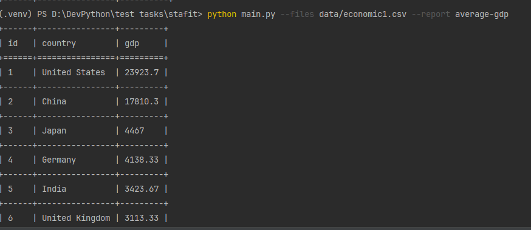

# Macro Reports

CLI утилита для генерации отчётов по макроэкономическим CSV данным.

## Установка

pip install -r requirements.txt

## Запуск

python main.py --files data/dataset1.csv --report average-gdp

## Отчёты

Сейчас реализован:

average-gdp — средний ВВП по странам

## Добавление нового отчёта

1. Создать файл в reports/
2. Наследовать BaseReport
3. Реализовать generate()
4. Зарегистрировать в reports/__init__.py

## Тестирование

Проверка тестов 
pytest -v
1. tests/test_average_gdp.py::test_average_gdp_basic
2. tests/test_average_gdp.py::test_sorting_desc
3. tests/test_average_gdp.py::test_single_country 

## Пример 
python main.py --files data/economic1.csv --report average-gdp

